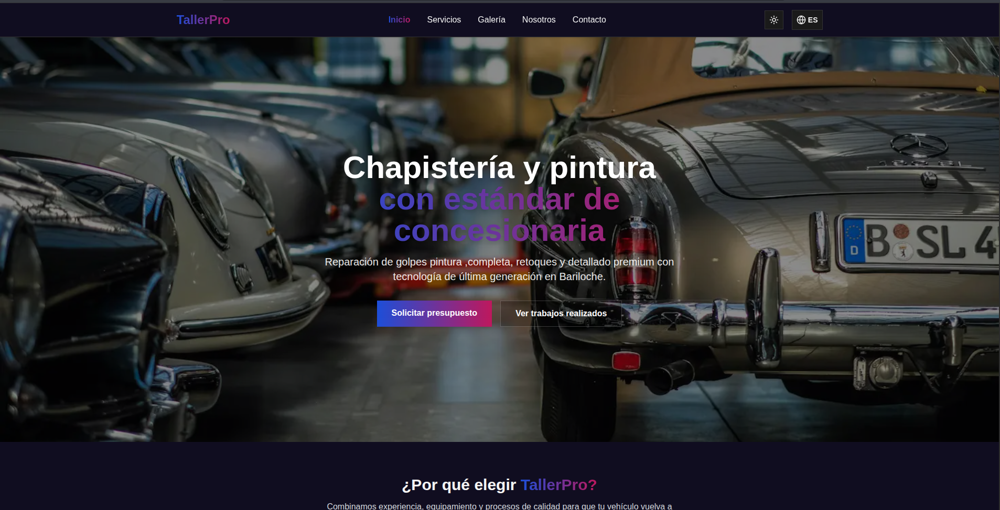

# TallerPro – Web de Chapistería y Pintura Automotriz

**Sitio web moderno, rápido y accesible**, construido con **Next.js 14**, **TailwindCSS**, **dark/light theme**, **i18n (ES/EN)**, animaciones suaves y UI premium con gradientes.

---

## 🏷️ Badges


---

## 🚀 Características principales

* 🌑 **Dark / Light mode** con persistencia
* 🌐 **Internacionalización (ES / EN)** con `LanguageProvider`
* 🎨 **UI Premium** con gradientes personalizados
* ⚡ **Animaciones suaves** usando framer-motion + secciones animadas
* 📱 **Diseño responsive**
* 🖼️ **Galería filtrable**
* 🔧 **Páginas de Servicios, Nosotros, Contacto**
* ✉️ Formulario de contacto estilizado
* 🧩 Arquitectura modular y escalable

---

## 🚀 Demo

* 👉 Live Demo: proximamente...
* 👉 Repositorio GitHub: link ...

## 🖥️ Previews

* 🏠 Home


(Hero con fondo, gradientes premium, animaciones suaves)

## 📦 Instalación

Requisitos:

* Node.js **18+**
* pnpm (**recomendado**), npm o yarn

### 1. Clonar el repositorio

```bash
git clone https://github.com/tuusuario/tallerpro.git
cd tallerpro
```

### 2. Instalar dependencias

```bash
pnpm install
# o
npm install
# o
yarn install
```

### 3. Ejecutar en desarrollo

```bash
pnpm dev
```

El proyecto estará disponible en:
➡️ **[http://localhost:3000](http://localhost:3000)**

---

## 🔧 Scripts útiles

| Script                                | Acción                              |
| ------------------------------------- | ----------------------------------- |
| `pnpm dev`                            | Corre el servidor de desarrollo     |
| `pnpm build`                          | Compila el proyecto para producción |
| `pnpm start`                          | Ejecuta la app compilada            |
| `pnpm lint`                           | Corre ESLint                        |
| `pnpm format` *(si agregás Prettier)* | Formatea el código                  |

---

## 🧱 Arquitectura del proyecto

```bash
app/
 ├── contacto/         → Página de contacto
 ├── galeria/          → Galería filtrable
 ├── servicios/        → Servicios ofrecidos
 ├── sobre-nosotros/   → Página institucional
 ├── providers/        → LanguageProvider (i18n)
 ├── i18n/             → JSON de traducciones ES/EN
 ├── layout.tsx        → Root layout (theme + provider)
 ├── page.tsx          → Página de inicio
 └── globals.css       → Configuración de Tailwind + estilos

components/
 ├── Navbar.tsx
 ├── Footer.tsx
 ├── ThemeToggle.tsx
 ├── AnimatedSection.tsx
 ├── ScrollSection.tsx
 ├── SkeletonCard.tsx
 ├── ui/               → Botones / componentes shadcn opcionales
 └── WhatsAppButton.tsx

hooks/
 └── useTheme.ts       → Hooks para theme system

public/
 └── imágenes organizadas por categorías

types/
 └── types.ts          → Tipado global para traducciones
```

---

## 🌐 Internacionalización (ES/EN)

El proyecto usa un **LanguageProvider** propio basado en `React Context`, lo que permite:

* Cambiar idioma desde la navbar
* Persistir selección en `localStorage`
* Uso simple desde cualquier componente:

```ts
import { useLanguage } from "@/app/providers/LanguageProvider";

const { t, lang, toggleLang } = useLanguage();
```

---

## 🌓 Sistema de temas (Dark / Light)

Implementado con **next-themes**:

```tsx
<ThemeProvider attribute="class" defaultTheme="light">
    ...
</ThemeProvider>
```

Y variables CSS personalizadas en `globals.css`:

* `--gradient-start`
* `--gradient-end`
* `--card`
* `--background`
* etc.

⚡ ¡Permite efectos premium y gradientes dinámicos en toda la UI!

---

## 🎨 Efectos visuales premium

Incluye clases personalizadas como:

* `card-premium`
* `card-premium2`
* `card-premium-soft`

Con efectos:

* Glow
* Bordes gradientes reales
* Blur suave
* Hover escalado

Ejemplo:

```html
<div class="card-premium-soft p-8 bg-card shadow-xl">...</div>
```

---

## 📸 Galería

Sistema de imágenes organizado desde `app/data/images.ts`, con filtros:

* Golpes
* Pintura
* Pulido
* Restauración

---

## 📬 Contacto del desarrollador

Si querés soporte o mantenimiento:

* ✉️ [guillermoneculqueo@gmail.com](guillermoneculqueo@gmail.com)
* 💼 [LinkedIn](www.linkedin.com/in/guillermoagustinneculqueo)
* 🌐 [Portfolio_desactualizado](https://guillenec.netlify.app/)
